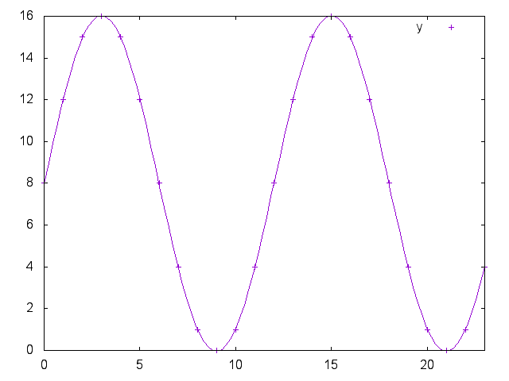

# ASCII Clock

A Haskell solution for the *ASCII Clock* programming challenge
using fitted trigonometric functions.

Charlie Brooking (@brookingcharlie)

## Running the solution

Use the supplied `go` script to run the solution as follows:

```
$ ./go
Usage: ./go run|test

$ ./go test
SUCCESS: ""
SUCCESS: "2:"
SUCCESS: "0:59"
...

$ echo "25:61" | ./go run
INVALID INPUT

$ echo "23:47" | ./go run
        o        
    h       o    
                 
 o             o 
                 
m               o
                 
 o             o 
                 
    o       o    
        o        
```

## Explanation of trigonometry

As a completely unnecessary stunt, the solution relies on two trigonometric
functions that were fit using [gnuplot](http://www.gnuplot.info). For each hour
mark on the clock (parameter *i*), these functions calculate the character
position as X and Y coordinates (i.e. line and column) starting from the
top-left of stdout.

These plots show points on the clockface and the fitted curve:

```
x(hour) = 8 sin(((2 pi / 12) hour) + 8
```



```
y(hour) = -4.644 cos((2 pi / 12) hour) + 5
```


(To view the gnuplot scripts used to fit functions and draw the graphs above,
see [fit-x.gp](fit-x.gp), [fit-y.gp](fit-y.gp), and [fit.sh](fit.sh).)

These equations make sense given that the clock has a horizontal radius of 8 and
a vertical radius of about 5, is centred around (8, 5), and has a period of 12.
Really the only interesting thing is the scaling factor of -4.644 as opposed to 5:
it turns out that using exactly 5 gives you a wonky looking clock! So maybe using
gnuplot was useful afterall.

For reference, here's the table of coordinates for the clockface:

```
        o            hour  x  y
    o       o        ---- -- --
                        0  0  8
 o             o        1  1 12
                        2  3 15
o               o       3  5 16
                        4  7 15
 o             o        5  9 12
                        6 10  8
    o       o           7  9  4
        o               8  7  1
                        9  5  0
                       10  3  1
                       11  1  4
```

## The Challenge

In this challenge you must draw an analogue clock face.

* The time is supplied on stdin in the format hh:mm, followed by a single newline.
  Both hh and mm are padded with a leading 0 (zero) if they are less than 10.
* The analogue clock face representing that time, subject to the following rules,
  should be written on stdout.
* Each hour mark should be drawn with 'o' (Lower-case O).
* The hour mark representing the hour given in the input should be drawn with an 'h'.
* The hour mark representing the minute given in the input should be drawn with an 'm'.
* If the hour and the minute both fall on the same mark, then you should draw it with an 'x'.
* You should round down the minutes past the hour to the nearest 5 for the
  purposes of marking it on the clock (so 23 becomes 20, 39 becomes 35).

Examples:

21:35

```
        o
    o       o

 o             o

h               o

 o             o

    m       o
        o
```

04:59

```
        o
    m       o

 o             o

o               o

 o             h

    o       o
        o
```

## To Win

We will be looking for:

* Clean code
* Evidence of TDD
* A go script
* A readme
* With extra credit for:
* Submitting a solution as a pair
